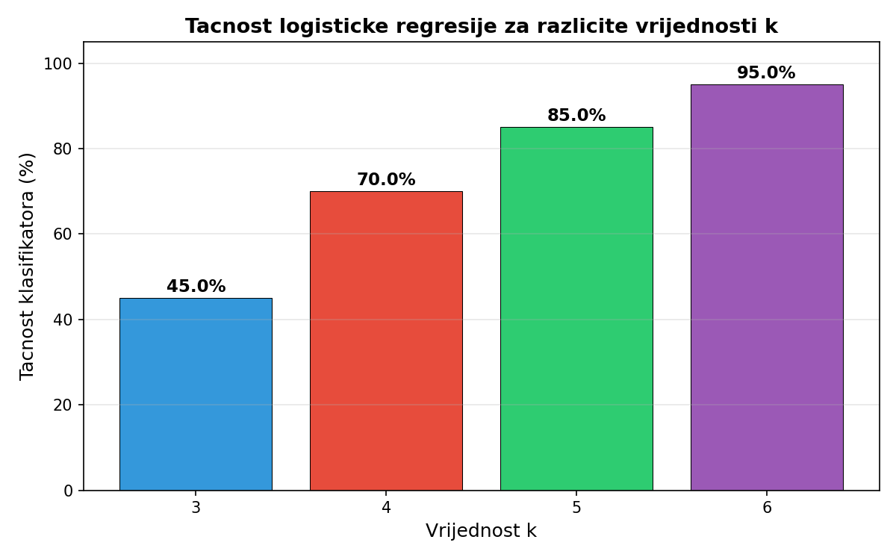
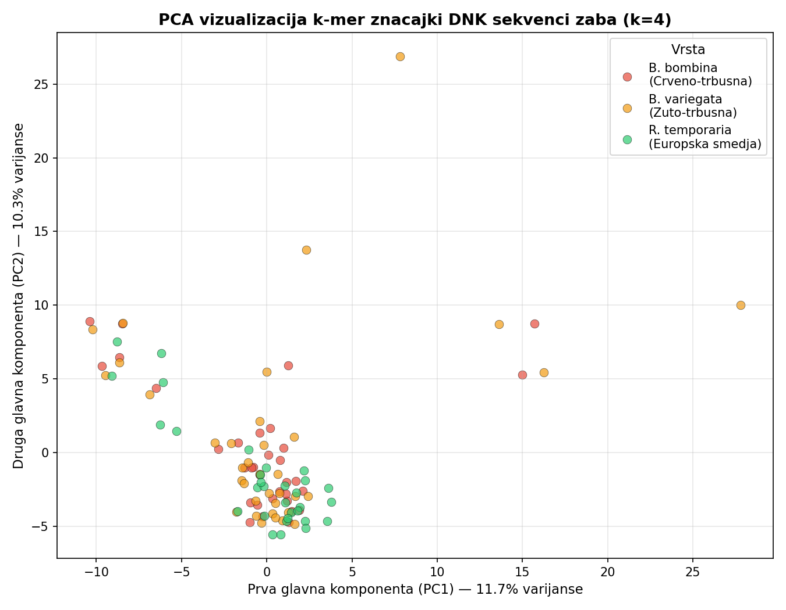
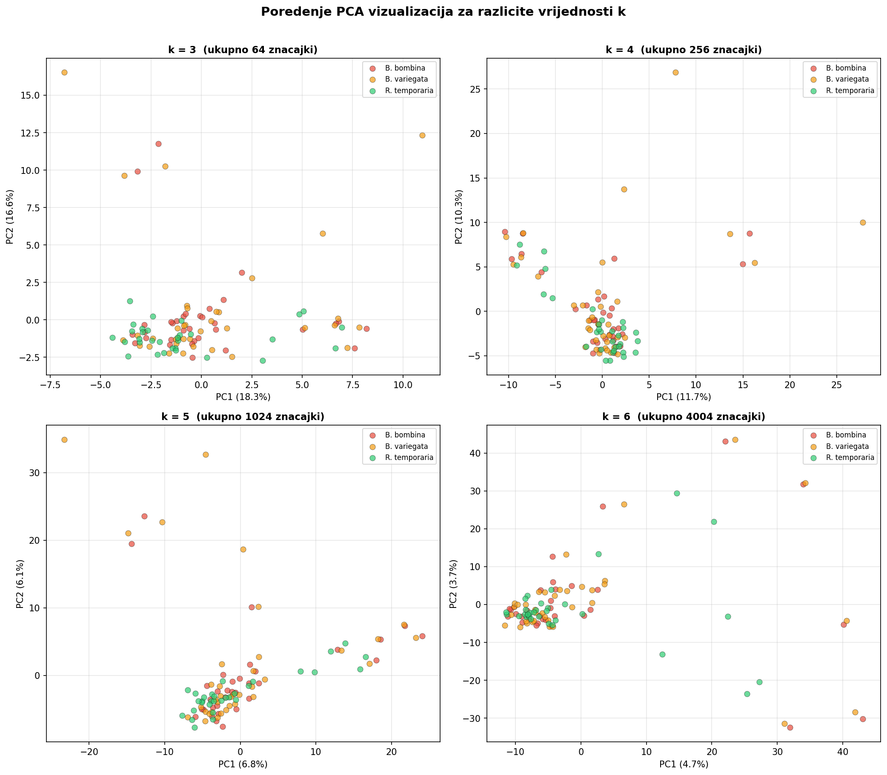
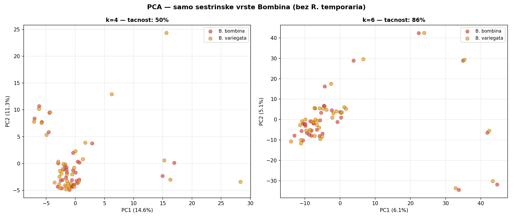
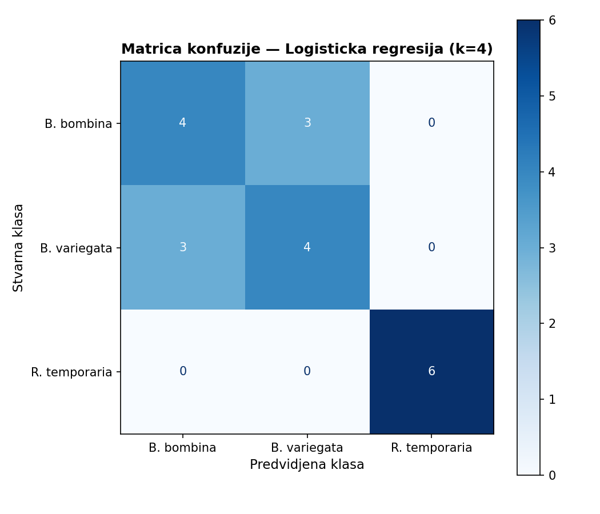
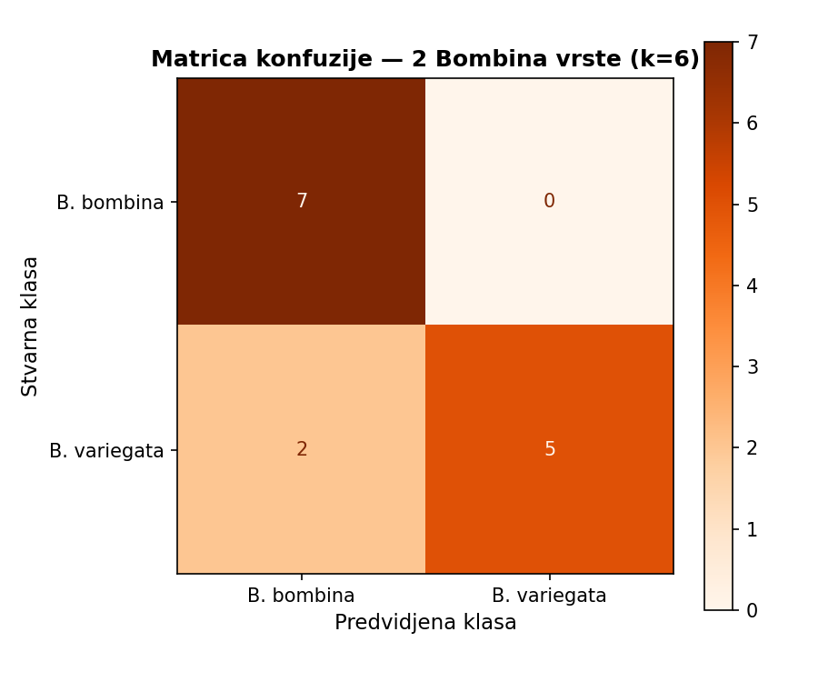
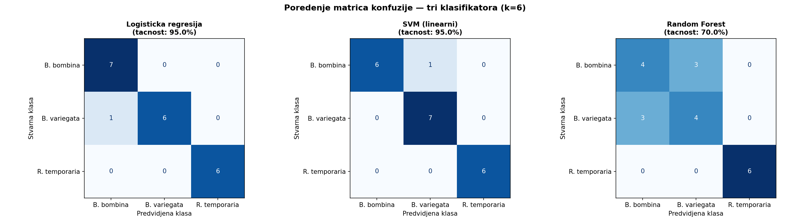
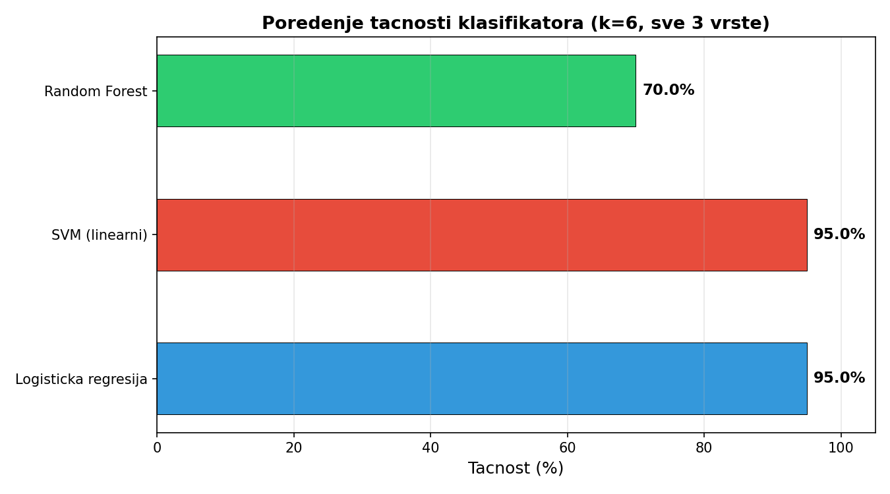

# 🧬 Frog DNA Sequence Analysis: K-mer Based Classification

This directory contains the Python pipeline and experimental outputs for classifying frog species purely based on numerical k-mer patterns derived from FASTA files.

## 📊 Output Gallery

Here is a visual overview of the generated outputs, demonstrating how models process and group genomic information without complex sequence alignment:

<table align="center">
  <tr>
    <td align="center">
       
      <b>Graph 1: Classifier Accuracy by K</b> 
      <i>Accuracy exponentially improves as K values transition from 3 to 6.</i>
    </td>
    <td align="center">
       
      <b>Graph 2: PCA Distribution for K=4</b> 
      <i>Clear isolation of R. temporaria and dense mixing of Bombina sister species.</i>
    </td>
  </tr>
  <tr>
    <td align="center">
       
      <b>Graph 3: Resolution Oscillation</b> 
      <i>The cluster resolution becomes visibly more defined as K increases.</i>
    </td>
    <td align="center">
       
      <b>Graph 4: Sister Species PCA</b> 
      <i>PCA distribution exclusively focusing on the closely related Bombina species.</i>
    </td>
  </tr>
  <tr>
    <td align="center">
       
      <b>Graph 5: Confusion Matrix K=4</b> 
      <i>High confusion and error rate among sister species at lower depth.</i>
    </td>
    <td align="center">
       
      <b>Graph 6: Confusion Matrix K=6</b> 
      <i>Optimized error reduction at K=6 for sister species.</i>
    </td>
  </tr>
  <tr>
    <td align="center">
       
      <b>Graph 7: Classifier Matrices</b> 
      <i>Comparative performance highlighting overfitting in Random Forest.</i>
    </td>
    <td align="center">
       
      <b>Graph 8: Models Bar Chart</b> 
      <i>Linear models (LR, SVM) demonstrating peak stability natively.</i>
    </td>
  </tr>
</table>

## 🔬 About the Pipeline
The `lab_pipeline.py` script applies numerical counting, scaling and feature extraction (using machine learning constructs such as Logistic Regression, linear Support Vector Machines, and tree classifiers) to explore feature sets hidden within raw numeric strings derived from biological sources.
